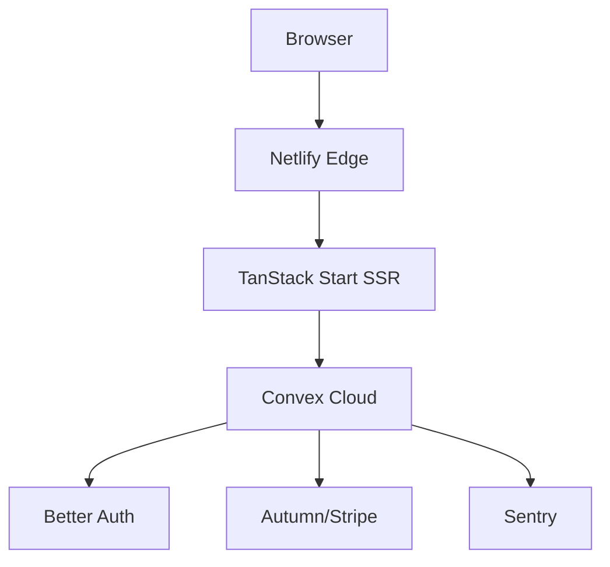
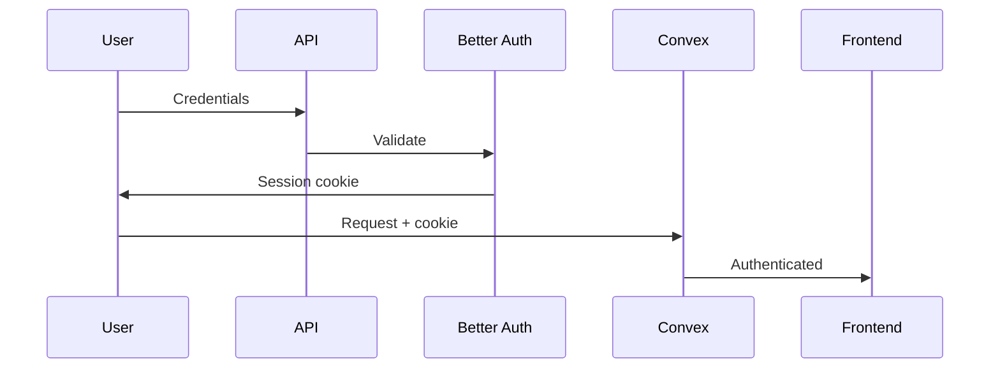
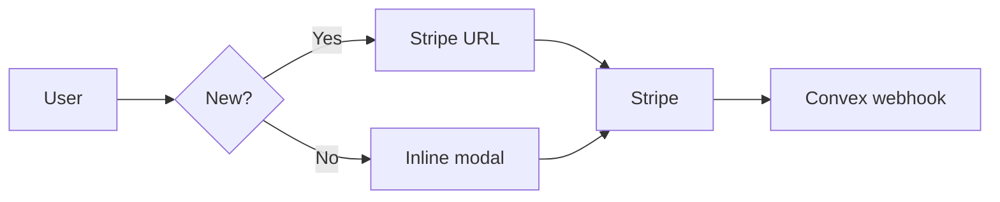

# Tanvex

[](https://github.com/ramonclaudio/tanvex/generate)
[](https://opensource.org/licenses/MIT)

SaaS starter with TanStack Start + Convex real-time backend, Better Auth, Autumn billing, and Sentry monitoring.

## Tech Stack

**Frontend:**
- [React 19](https://react.dev) - UI library with concurrent features
- [TanStack Start](https://tanstack.com/start) - Full-stack React framework with SSR
- [TanStack Router](https://tanstack.com/router) - Type-safe file-based routing
- [TanStack Query](https://tanstack.com/query) - Server state management
- [Tailwind CSS 4](https://tailwindcss.com) - Utility-first styling
- [Radix UI](https://radix-ui.com) - Accessible component primitives
- [shadcn/ui](https://ui.shadcn.com) - Beautiful components built on Radix

**Backend:**
- [Convex](https://convex.dev) - Real-time serverless backend with database
- [Better Auth](https://better-auth.com) - Type-safe authentication
- [Autumn](https://useautumn.com) - Stripe billing integration

**Monitoring:**
- [Sentry](https://sentry.io) - Error tracking and performance monitoring

**Deployment:**
- [Netlify](https://netlify.com) - Edge hosting with auto-deploys

**Developer Experience:**
- [TypeScript](https://typescriptlang.org) - Type safety
- [Vite](https://vitejs.dev) - Lightning-fast build tool
- [Bun](https://bun.sh) - Fast all-in-one runtime
- [Vitest](https://vitest.dev) - Unit testing
- [Prettier](https://prettier.io) + [ESLint](https://eslint.org) - Code quality

---

## Quick Start

### Prerequisites

- [Bun](https://bun.sh) installed
- [Convex account](https://convex.dev) (free tier available)
- [Autumn account](https://useautumn.com) for Stripe integration

### 1. Install HTTPS Certificates

> [!WARNING]
> Better Auth requires HTTPS in development.

```bash
brew install mkcert && mkcert -install
mkdir certificates
mkcert -key-file certificates/localhost-key.pem -cert-file certificates/localhost.pem localhost 127.0.0.1 ::1
```

See [docs/SETUP.md](docs/SETUP.md) for Linux/Windows instructions.

### 2. Install and Configure

```bash
# Clone and install
git clone https://github.com/ramonclaudio/tanvex.git
cd tanvex
bun install

# Start Convex (auto-fills .env.local)
bunx convex dev
```

### 3. Set Environment Variables

**In [Convex Dashboard](https://dashboard.convex.dev) → Settings → Environment Variables:**

```bash
# Required
BETTER_AUTH_SECRET=<openssl rand -base64 32>
AUTUMN_SECRET_KEY=<from https://app.useautumn.com>
VITE_DEV_SITE_URL=https://localhost:3000
```

See [docs/ENVIRONMENT.md](docs/ENVIRONMENT.md) for complete variable reference.

### 4. Start Development

```bash
bun run dev  # Opens https://localhost:3000
```

**Optional integrations:** GitHub OAuth, CodeRabbit AI reports, Sentry monitoring - see [docs/INTEGRATIONS.md](docs/INTEGRATIONS.md)

---

## Features

- **Authentication** - Email/password with optional GitHub OAuth
- **Billing** - Multi-tier subscriptions (Free/Starter/Pro) with Stripe
- **Real-time DB** - Live data sync via Convex WebSocket
- **Dark Mode** - System preference detection + localStorage persistence
- **Type Safety** - End-to-end TypeScript with Zod validation
- **Error Tracking** - Sentry integration with correlation IDs
- **Responsive UI** - Mobile-first design with Tailwind
- **AI Reports** - CodeRabbit code review summaries (optional)

---

## Architecture



**Key flows:**

<details>
<summary>Authentication</summary>



</details>

<details>
<summary>Billing</summary>



</details>

---

## Development

```bash
bun run dev          # Dev server (https://localhost:3000)
bun run build        # Production build
bun run typecheck    # Type checking
bun run lint         # Lint code
bun run format       # Format code
bun run check        # Lint + format + typecheck
bun run test         # Run tests
```

**Deploy to Netlify:**
```bash
bunx convex deploy   # Deploy backend to Convex
git push origin main # Deploy frontend to Netlify (auto-deploys on push)
```

See [docs/SETUP.md](docs/SETUP.md) for complete production deployment guide.

---

## Documentation

- [Setup Guide](docs/SETUP.md) - Detailed installation and configuration
- [Environment Variables](docs/ENVIRONMENT.md) - All env vars explained (dev vs prod)
- [Integrations](docs/INTEGRATIONS.md) - GitHub OAuth, CodeRabbit, Sentry setup
- [Security](docs/SECURITY.md) - CORS, rate limiting, session handling
- [Monitoring](docs/MONITORING.md) - Sentry config, logging, performance
- [Troubleshooting](docs/TROUBLESHOOTING.md) - Common problems and solutions

---

## Common Issues

| Problem | Solution |
|---------|----------|
| Convex deployment not found | Run `bunx convex dev` to initialize |
| Better Auth errors | Verify `BETTER_AUTH_SECRET` in Convex Dashboard |
| GitHub OAuth fails | Optional feature - set `DEV_GITHUB_CLIENT_ID` if needed |
| HTTPS certificate errors | Run `mkcert -install` and regenerate certificates |

Full troubleshooting: [docs/TROUBLESHOOTING.md](docs/TROUBLESHOOTING.md)

---

## Project Structure

```
tanvex/
├── app/
│   ├── routes/          # File-based routing
│   ├── components/      # React components
│   └── lib/             # Client utilities
├── convex/
│   ├── schema.ts        # Database schema
│   ├── auth.config.ts   # Better Auth config
│   ├── autumn.ts        # Billing integration
│   └── lib/             # Server utilities
├── docs/                # Documentation
└── public/              # Static assets
```

---

## Contributing

Contributions welcome! Please open an issue first to discuss changes.

---

## License

MIT © [Ramon Claudio](https://github.com/Ramon Claudio)

---

## Acknowledgments

Built with amazing open-source tools:
- [TanStack](https://tanstack.com) - Tanner Linsley
- [Convex](https://convex.dev) - Convex team
- [Better Auth](https://better-auth.com) - Better Auth team
- [Autumn](https://useautumn.com) - Autumn team
