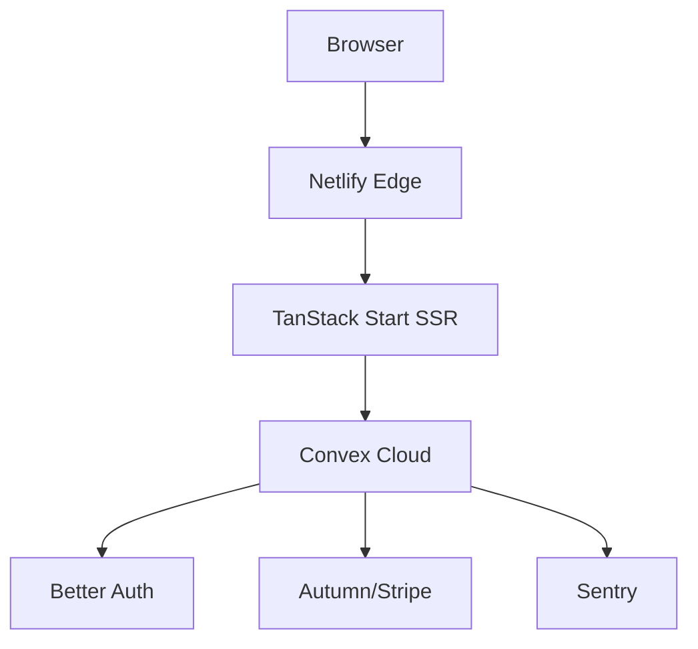
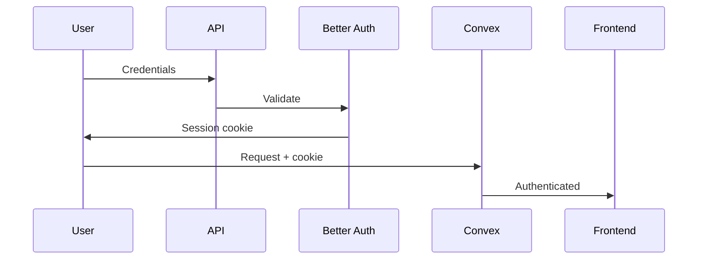
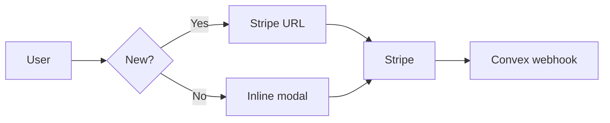

# Tanvex

TanStack Start + Convex with auth, billing, and monitoring.

**Stack:** React 19 • TanStack Start/Router/Query • Convex • Better Auth • Autumn (Stripe) • Sentry

## Quick Start

> [!WARNING]
> Requires HTTPS certificates for Better Auth. See [SETUP.md](docs/SETUP.md) for full instructions.

```bash
# 1. Install HTTPS certs (one-time)
brew install mkcert && mkcert -install
mkdir certificates && mkcert -key-file certificates/localhost-key.pem -cert-file certificates/localhost.pem localhost

# 2. Install and run
bun install
bunx convex dev  # Auto-fills .env.local
bun run dev      # https://localhost:3000
```

> [!IMPORTANT]
> Set these in [Convex Dashboard](https://dashboard.convex.dev) → Settings → Environment Variables:
>
> ```bash
> BETTER_AUTH_SECRET=<openssl rand -base64 32>
> AUTUMN_SECRET_KEY=<from https://app.useautumn.com>
> VITE_DEV_SITE_URL=https://localhost:3000
> ```

**Optional integrations:** GitHub OAuth, CodeRabbit, Sentry - see [docs/INTEGRATIONS.md](docs/INTEGRATIONS.md)

---

## Architecture



**Key flows:**

<details>
<summary>Authentication</summary>



</details>

<details>
<summary>Billing</summary>



</details>

---

## Development

```bash
bun run dev          # Dev server
bun run build        # Production build
bun run typecheck    # Type checking
bun run check        # Lint + format + typecheck
```

**Deploy:**
```bash
bunx convex deploy   # Backend
git push origin main # Frontend (Netlify auto-deploys)
```

---

## Common Issues

| Problem | Solution |
|---------|----------|
| Convex deployment not found | Run `bunx convex dev` to initialize |
| Better Auth errors | Verify `BETTER_AUTH_SECRET` in Convex Dashboard |
| GitHub OAuth fails | Use `DEV_GITHUB_CLIENT_ID` prefix for dev environment |
| CodeRabbit reports fail | Requires Pro subscription + 10min generation time |

Full troubleshooting: [docs/TROUBLESHOOTING.md](docs/TROUBLESHOOTING.md)

---

## Documentation

- [Setup Guide](docs/SETUP.md) - Detailed installation and configuration
- [Environment Variables](docs/ENVIRONMENT.md) - All env vars explained (dev vs prod)
- [Integrations](docs/INTEGRATIONS.md) - GitHub OAuth, CodeRabbit, Sentry setup
- [Security](docs/SECURITY.md) - CORS, rate limiting, session handling
- [Monitoring](docs/MONITORING.md) - Sentry config, logging, performance
- [Troubleshooting](docs/TROUBLESHOOTING.md) - Common problems and solutions

---

## License

MIT
